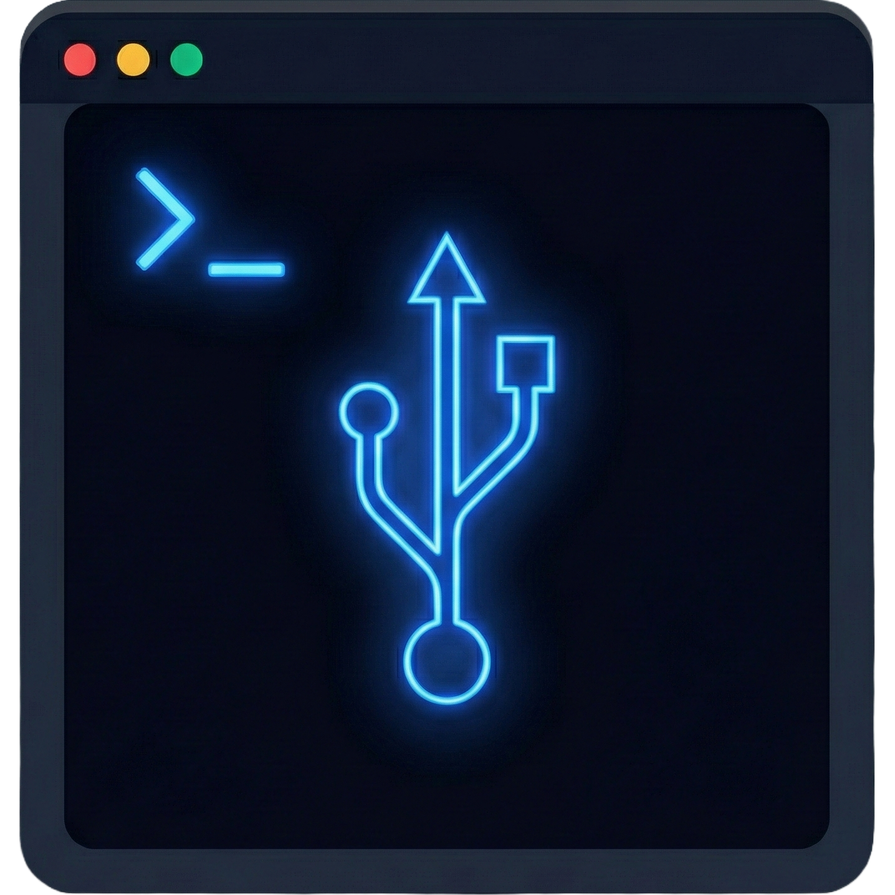
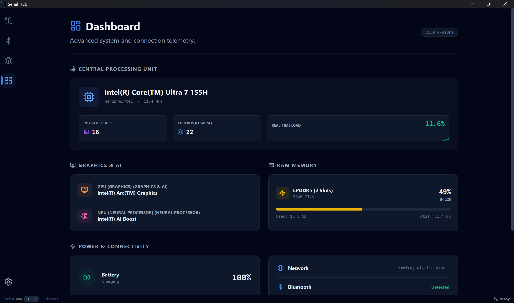
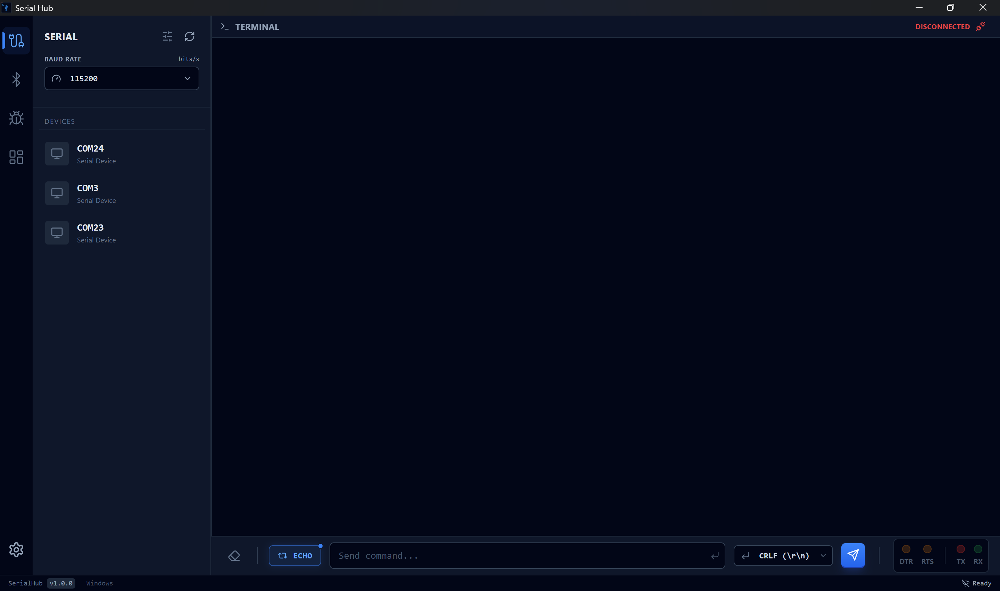
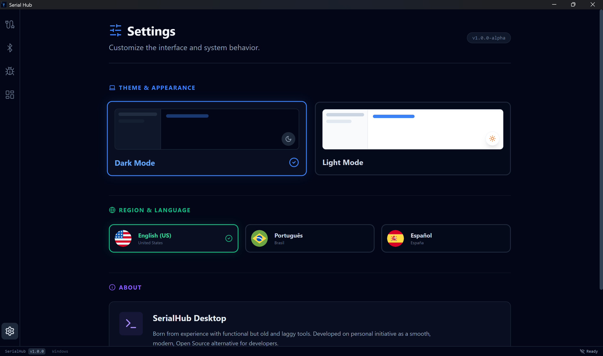

<div align="center">
  
  
  # SerialHub 🚀

  **A high-performance, cross-platform serial monitor designed for embedded systems engineers.**

  [](https://v2.tauri.app/)
  [](https://www.rust-lang.org/)
  [](https://react.dev/)
  [](https://opensource.org/licenses/MIT)
  [](https://github.com/seu-usuario/SerialHub/stargazers)

  [Features](#✨-key-features) • [Showcase](#📸-interface-preview) • [Tech Stack](#🛠️-tech-stack) • [Getting Started](#🚀-getting-started) • [Roadmap](#🗺️-roadmap)

</div>

---

## ✨ Why SerialHub?

Most serial terminals are either outdated or resource-heavy. **SerialHub** solves this by combining a blazing-fast **Rust** backend with a modern, responsive interface. It doesn't just show data; it monitors your entire development environment.

* **High Throughput:** Industrial-grade backend using **Intelligent Data Batching**. Handles high baud rates (e.g., 921600) without UI lag.
* **Advanced Telemetry:** A dedicated **Hardware Dashboard** to monitor CPU, RAM, GPU, and even NPU usage, alongside real-time serial traffic stats.
* **Developer First:** Built-in command history, HEX/ASCII views, DTR/RTS pin control, and session logging.
* **Modern Stack:** Dark/Light modes, internationalization (EN/PT/ES), and a VS Code-inspired layout.

---

## 📸 Interface Preview

### 📊 Hardware & Telemetry Dashboard
The dashboard provides a bird's-eye view of your host machine's vitals. Monitor CPU load, memory usage, and connection stability in real-time while you debug your firmware.


<br />

### 🖥️ Professional Serial Terminal
Featuring a high-performance terminal engine based on `xterm.js`. Supports smooth zooming, ANSI colors, and smart data buffering to ensure no character is lost even at high speeds.


<br />

### ⚙️ Global Configuration
Tailor the experience to your needs. Switch between English, Portuguese, and Spanish, toggle dark/light themes, and manage global application settings effortlessly.


---

## 🛠️ Tech Stack

* **Backend:** [Rust](https://www.rust-lang.org/) + [Tauri v2](https://v2.tauri.app/) (System-level performance & safety).
* **Frontend:** [React](https://react.dev/) + [TypeScript](https://www.typescriptlang.org/) + [Tailwind CSS](https://tailwindcss.com/).
* **Terminal Engine:** [xterm.js](https://xtermjs.org/) (Standard-compliant terminal rendering).
* **State Management:** [Zustand](https://zustand-demo.pmnd.rs/) (Persisted settings and telemetry).

---

## 🚀 Getting Started

### Prerequisites
- [Node.js](https://nodejs.org/) (v18+)
- [Rust & Cargo](https://www.rust-lang.org/tools/install)
- WebView2 (Windows) or WebKitGTK (Linux)

### Installation & Development
1. **Clone the repository:**

```bash
git clone https://github.com/WigoWigo10/SerialHub.git
cd SerialHub
```

2. **Install dependencies:**
```bash
npm install
```


3. **Run in dev mode:**
```bash
npm run tauri dev
```


### Building for Release

To generate a standalone executable (`.exe`, `.deb`, `.AppImage`):

```bash
npm run tauri build
```

---

## 🧩 Project Structure

```text
SerialHub/
├── src/
│   ├── components/    # UI Components (Sidebar, Dashboard, Terminal)
│   ├── stores/        # Global State (Zustand)
│   ├── hooks/         # Custom React hooks (i18n, events)
│   └── App.tsx        # Main Layout & Routing
├── src-tauri/
│   ├── src/
│   │   ├── commands/  # Rust Logic (Serial Port, Hardware Stats)
│   │   └── lib.rs     # Tauri Plugin & Bridge configuration
│   └── capabilities/  # Security permissions
└── README.md

```

---

## 🗺️ Roadmap

* [x] High-performance Serial Connection (Batching optimized)
* [x] Hardware Telemetry Dashboard (CPU/RAM/GPU/NPU/Battery)
* [x] Internationalization (EN, PT-BR, ES)
* [x] Command History & Pin Control (DTR/RTS)
* [ ] **v1.2:** Bluetooth Low Energy (BLE) Support
* [ ] **v1.2:** Spy / Bridge Mode for dual-port sniffing
* [ ] **v1.5:** Advanced Protocol Analyzer (Visual graphs from serial data)

---

## 📄 License

This project is licensed under the **MIT License**.

## 🤝 Contributing

Contributions are welcome! Feel free to open an issue or submit a pull request for any features or bug fixes.